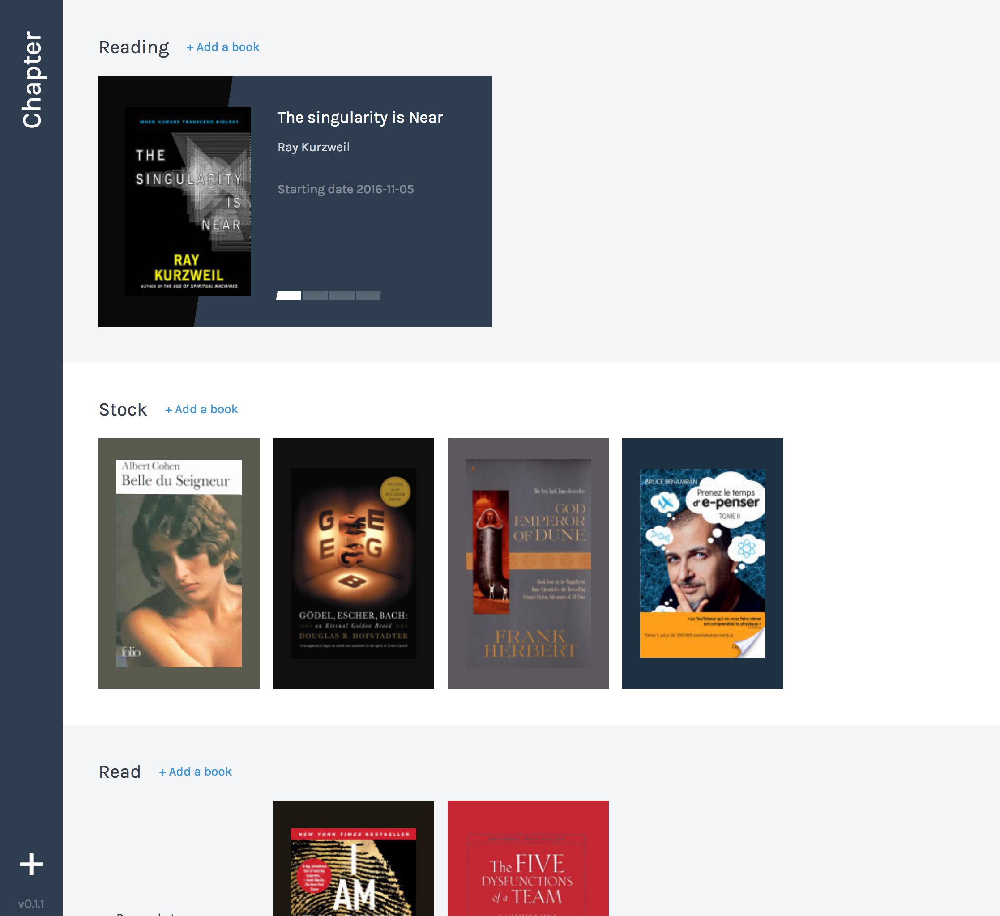

# Chapter [](https://circleci.com/gh/n6g7/chapter/tree/master) [](https://www.bithound.io/github/n6g7/chapter)



## Install

```sh
npm i
```

## How to:

 - dev? `npm run dev`
 - build? `npm run build`
 - test? `npm test`

## Todo

 - [X] Beautiful design
 - [X] Update book
 - [X] Delete book
 - [X] Detect cover colour palette
 - [X] Drag & Drop books
 - [ ] Sort books by read date
 - [ ] Import/export feature
 - [ ] Books timeline
